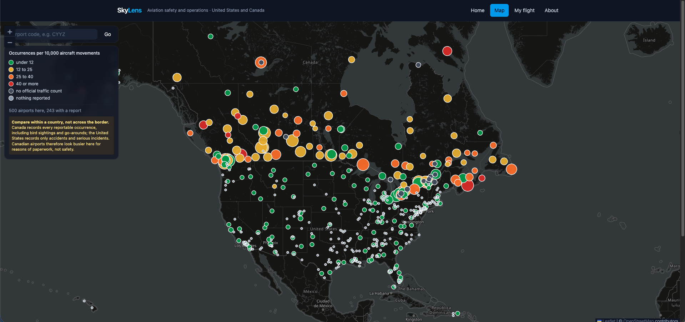
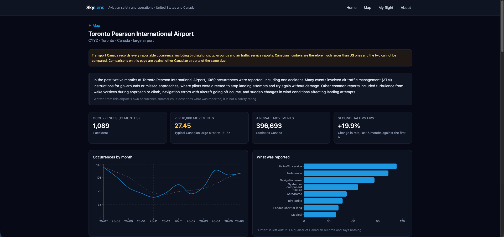
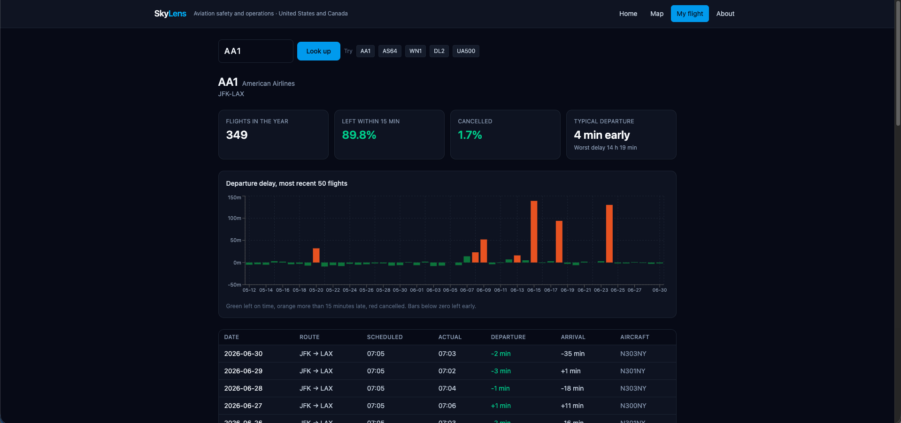
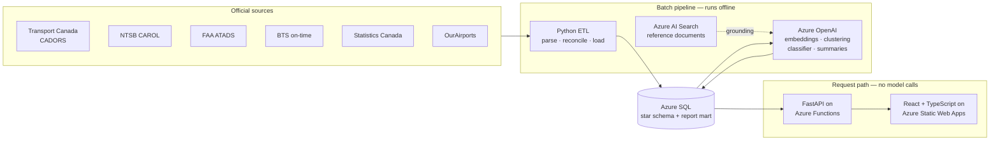

# SkyLens

Aviation safety and operations for every airport in the United States and Canada,
built from official public data.

Both countries publish tens of thousands of occurrence reports a year — bird
strikes, go-arounds, runway incursions, laser illuminations, accidents — and
both publish them in formats nobody outside the industry can read. SkyLens
brings a full year of them together, expresses them as rates rather than raw
counts so a regional field can be compared with a major hub, and writes each one
out in a sentence anyone can follow.

**Live site:** _(add URL)_ · **API:** _(add URL)_

---

## Screenshots

| | |
|---|---|
|  |  |
|  |  |

---

## What it does

- **A map of every airport** in the US and Canada, coloured by what gets reported there.
- **A report page for 495 airports** — the twelve-month trend, the breakdown by
  occurrence category, a comparison against airports of the same size and country,
  and a written summary of what actually happened.
- **A flight-number lookup** for US domestic flights: how often it left late, how
  often it was cancelled, and every leg it flew.

## Architecture



The important line in that diagram is the last one. **No model is called while
anyone uses the site.** Every embedding, cluster, category and summary was
computed in advance and written to SQL, so a page load is a handful of indexed
reads. That keeps the site fast, cheap and available when the model is not.

## The data

| Source | What it provides | Coverage |
|---|---|---|
| Transport Canada CADORS | Canadian occurrence reports, with an official category on each | 23,285 in window |
| NTSB CAROL | US accident and incident reports, plus narrative text where published | 1,226 in window |
| FAA ATADS | Official movement counts at towered US airports | 528 airports |
| Statistics Canada 23-10-0296 | Official movements at Canadian airports | 121 airports |
| BTS on-time performance | ~7M US airline flights; flight page and fallback denominator | 12 months |
| OurAirports | Names, locations and the identifier crosswalk | current |

Analysis window: **1 July 2025 – 30 June 2026**, the most recent period where
every source has complete published data. A database view enforces it, so a
query cannot accidentally mix years:

```sql
CREATE VIEW v_occurrence_analysis AS
SELECT * FROM fact_occurrence WHERE in_analysis_window = 1;
```

### Why rates, not counts

A busy airport reports more of everything. Dividing by actual aircraft movements
is what makes two airports comparable — and it changes the answer: several
mid-sized airports rank above the largest hubs once traffic is taken into
account. Where no official movement count exists, the site shows the count and
leaves the rate blank rather than inventing a denominator.

Building that denominator was most of the work. It needed three separate
government sources, and airports had to be reconciled across four different
identifier systems (ICAO, IATA, FAA LOCID, and OurAirports' own).

## The model work, and its limits

| Step | What it does |
|---|---|
| Embeddings | `text-embedding-3-small` over NTSB narrative text |
| Themes | k-means (k=12, cosine) over those vectors, labelled by `gpt-4.1-mini` |
| Categories | TF-IDF + logistic regression, predicting ICAO CICTT categories for US reports, which arrive with none |
| Summaries | One plain-English sentence per occurrence, grounded in passages retrieved from the FAA Pilot/Controller Glossary and three other reference documents via hybrid search |

Stated honestly, because it matters more than the numbers:

- The classifier's training labels were **drafted by a language model and not
  reviewed by a person**. Its macro F1 of 0.485 measures how closely a small
  model reproduces a larger one's labels — not accuracy against ground truth.
  Full metrics in [`docs/model-metrics.md`](docs/model-metrics.md).
- Every predicted category is stored with `category_source = 'model'` and its
  confidence, and is labelled **predicted** everywhere it appears on the site.
- Canadian categories come from Transport Canada and are never overwritten.
- Only 3 of 168 fatal US accidents in the window have a published probable cause
  yet; final reports take a year or more. Anything built on report text
  therefore leans toward simpler, quickly closed cases. This is called out on
  the site itself, not just here.

## Running it locally

```bash
python -m venv .venv && source .venv/bin/activate
pip install -r requirements-dev.txt          # runtime deps plus the pipeline and tests
cp .env.example .env                         # then fill in your own Azure values

uvicorn api.main:app --reload                # http://127.0.0.1:8000/docs
cd web && npm install && npm run dev         # http://localhost:5173
```

`requirements.txt` is the API runtime only — 19 packages. The pipeline's
dependencies (pandas, scikit-learn, the Azure SDKs) live in
`requirements-dev.txt` and never reach the server.

Rebuilding the data from scratch is a sequence of batch jobs:

```bash
python etl/load.py                  # parse and load every source
python ai/embed.py                  # embeddings for NTSB text
python ai/cluster.py                # themes
python ai/classify.py               # category model
python ai/docs.py                   # index the reference documents
python ai/summarize.py              # plain-English summaries
python ai/build_mart.py             # per-airport report payloads
```

Each is resumable and caches by input, so an interrupted run costs nothing to
restart. Regenerating all 3,497 summaries costs about $1.40.

## Tests and CI

```bash
pytest
```

36 tests, no database required: the API reads through exactly two functions, so
the suite replaces them with a fake and asserts on the SQL built, the parameters
bound and the shape returned. [`.github/workflows/ci.yml`](.github/workflows/ci.yml)
runs them on every push, alongside a frontend type-check and build and a scan
for committed secrets.

## Deployment

Full steps in [`docs/deploy.md`](docs/deploy.md).

- **API** — Azure Functions (Flex Consumption), the FastAPI app handed over as ASGI
- **Site** — Azure Static Web Apps, built from this repository by GitHub Actions
- **Database** — Azure SQL serverless, which pauses when idle
- **Admin page** — `/admin`, behind Entra ID sign-in
- **Governance** — an Azure Policy rule requiring a `project` tag on every
  resource, so cost is attributable ([`infra/`](infra/))
- **Container** — a `Dockerfile` for the API, for anywhere that runs containers

The whole thing sits inside the free grants, aside from a few dollars of batch
model usage.

## Known limits

- Canadian movement counts include local training circuits, so flight-training
  airports read high against airports of similar size.
- Canada reports far more occurrences than the US for the same kind of event —
  a difference in reporting thresholds, not in safety. Peer comparisons are
  therefore scoped by country.
- Airports with fewer than five occurrences get no report page; small numbers
  swing a rate wildly.
- Flight lookup is US domestic only. Canadian carriers do not publish
  flight-level on-time data.
- **A high rate is not a safety rating.** It largely reflects how diligently
  people report.

## Repository layout

```
etl/     parsers and loaders, one module per source
ai/      embeddings, clustering, classifier, summaries, report mart
db/      schema, migrations, reference seeds
api/     FastAPI service
web/     React + TypeScript front end
infra/   Azure Policy definition
tests/   pytest suite
docs/    data notes, model metrics, themes, deployment guide
```

## Licence and attribution

Built on public data from Transport Canada, the NTSB, the FAA, the Bureau of
Transportation Statistics, Statistics Canada and OurAirports. Not an official
source, not affiliated with any aviation authority, and not for operational use.
