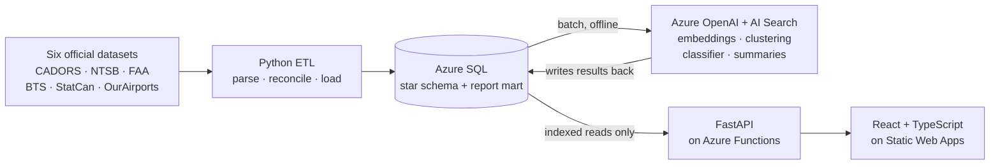

# SkyLens

Aviation safety and operations for every airport in the United States and Canada,
built end to end on Azure from official government data.

**Live site:** https://victorious-forest-063a7c30f.3.azurestaticapps.net · **API docs:** https://skylens-api-varun.azurewebsites.net/docs

> The database is serverless and pauses when idle, so the first request after a
> quiet spell takes up to a minute while it wakes. Reload once if a panel is slow.

Transport Canada and the NTSB publish tens of thousands of occurrence reports a
year — bird strikes, go-arounds, runway incursions, accidents — in spreadsheets
and coded exports nobody outside the industry reads. SkyLens loads a full year
of them into a warehouse, works out how often things happen *relative to how
busy each airport is*, and writes each occurrence up as a readable summary.

| | |
|---|---|
|  |  |
|  |  |

---

## What it does

- **A map** of every airport in both countries, coloured by occurrence rate.
- **A report page for 495 airports** — twelve-month trend, category breakdown, a
  comparison against airports of the same size and country, and a written summary.
- **A flight-number lookup** for US domestic flights: delays, cancellations, and
  every leg flown in the window.

## Built on Azure

Nine services, each doing a specific job rather than being there for the badge:

| Service | What it does here |
|---|---|
| **Azure SQL** (serverless) | Star-schema warehouse — five source systems reconciled into one occurrence fact table, plus the precomputed report mart the site reads. Auto-pauses when idle, which the API's retry logic handles. |
| **Azure OpenAI** | `text-embedding-3-small` for embeddings, `gpt-4.1-mini` for theme labels and summaries. Batch only — never called while anyone is using the site. |
| **Azure AI Search** | Hybrid retrieval (BM25 + HNSW vectors) over four aviation reference documents, used to ground every generated summary in a real source. |
| **Azure Document Intelligence** | Layout extraction from those reference PDFs before they are chunked and indexed. |
| **Azure Functions** (Flex Consumption) | Hosts the FastAPI service, handed over as ASGI so the same app runs locally, in a container and in the cloud. |
| **Azure Static Web Apps** | Hosts the React front end, rebuilt from this repository by GitHub Actions on every push to `main`. |
| **Microsoft Entra ID** | Application registration for admin sign-in on `/admin`. |
| **Azure Policy** | Denies any resource created in the group without a `project` tag, so spend is always attributable. |
| **Application Insights** | Request traces and cold-start timings for the API. |

Everything sits inside the free grants apart from a few dollars of batch model usage.

## Architecture



Read that middle line as a loop that runs **before** anyone visits: the models
read from SQL and write their output back into it. By the time a request
arrives, every embedding, cluster, category and summary is already a row. A page
load is a handful of indexed reads.

That is the main design decision in the project. It means page loads are fast
and free, the site stays up when the model API doesn't, and regenerating all
3,497 summaries costs about $1.40 — a number that would otherwise be a bill
that grows with traffic.

## What the models actually do

| Step | How |
|---|---|
| **Embeddings** | `text-embedding-3-small` over NTSB narrative text, stored as vectors in SQL |
| **Themes** | k-means (k=12, cosine) over those vectors; `gpt-4.1-mini` names each cluster from its five nearest reports |
| **Categories** | TF-IDF + logistic regression, assigning ICAO CICTT categories to US reports, which arrive with none |
| **Summaries** | One readable sentence per occurrence, grounded in passages retrieved from the FAA Pilot/Controller Glossary and three other reference documents via hybrid search |

And the limits, stated plainly because they matter more than the scores:

- The classifier's training labels were **drafted by a language model and never
  reviewed by a person**. Its macro F1 of 0.485 measures how closely a small
  model reproduces a larger one's labels, not accuracy against ground truth.
  Full metrics in [`docs/model-metrics.md`](docs/model-metrics.md).
- Every predicted category is stored with `category_source = 'model'` and its
  confidence, and is labelled **predicted** everywhere it appears on the site.
- Canadian categories come from Transport Canada and are never overwritten.
- Only 3 of 168 fatal US accidents in the window have a published probable cause
  yet — final reports take a year or more — so anything built on report text
  leans toward simpler, quickly closed cases. The site says so itself.

## The data

| Source | What it provides | Coverage |
|---|---|---|
| Transport Canada CADORS | Canadian occurrence reports, with an official category on each | 23,285 in window |
| NTSB CAROL | US accident and incident reports, plus narrative text where published | 1,226 in window |
| FAA ATADS | Official movement counts at towered US airports | 528 airports |
| Statistics Canada 23-10-0296 | Official movements at Canadian airports | 121 airports |
| BTS on-time performance | ~7M US airline flights; the flight page and a fallback denominator | 12 months |
| OurAirports | Names, locations and the identifier crosswalk | current |

Analysis window: **1 July 2025 – 30 June 2026**, the most recent period where
every source has complete published data. A view enforces it, so no query can
accidentally mix years:

```sql
CREATE VIEW v_occurrence_analysis AS
SELECT * FROM fact_occurrence WHERE in_analysis_window = 1;
```

### Why rates, not counts

A busy airport reports more of everything. Dividing by actual aircraft movements
is what makes two airports comparable — and it changes the answer: several
mid-sized airports rank above the largest hubs once traffic is accounted for.
Where no official movement count exists, the site shows the count and leaves the
rate blank rather than inventing a denominator.

Building that denominator was the hardest part of the project. It needed three
separate government sources, and airports had to be reconciled across four
identifier systems (ICAO, IATA, FAA LOCID, and OurAirports' own).

## Running it locally

```bash
python -m venv .venv && source .venv/bin/activate
pip install -r requirements-dev.txt          # runtime deps plus the pipeline and tests
cp .env.example .env                         # then fill in your own Azure values

uvicorn api.main:app --reload                # http://127.0.0.1:8000/docs
cd web && npm install && npm run dev         # http://localhost:5173
```

`requirements.txt` is the API runtime only — 19 packages. The pipeline's
dependencies (pandas, scikit-learn, the Azure SDKs) live in
`requirements-dev.txt` and never reach the server.

Rebuilding the data is a sequence of batch jobs:

```bash
python etl/load.py                  # parse and load every source
python ai/embed.py                  # embeddings for NTSB text
python ai/cluster.py                # themes
python ai/classify.py               # category model
python ai/docs.py                   # index the reference documents
python ai/summarize.py              # summaries
python ai/build_mart.py             # per-airport report payloads
```

Each is resumable and caches by input, so an interrupted run costs nothing to restart.

## Tests and CI

```bash
pytest
```

37 tests, no database required: the API reads through exactly two functions, so
the suite replaces them with a fake and asserts on the SQL built, the parameters
bound and the shape returned. [`.github/workflows/ci.yml`](.github/workflows/ci.yml)
runs them on every push alongside a frontend type-check, a production build and
a scan for committed secrets.

## Deployment

Full steps in [`docs/deploy.md`](docs/deploy.md). A `Dockerfile` is included for
running the API anywhere containers run.

`/admin` is protected by platform sign-in. The Entra ID application is
registered and configured, but binding a custom identity provider to a Static
Web App requires the Standard plan, so the deployed Free-plan site uses the
built-in provider instead — a cost decision, documented rather than hidden.

## Known limits

- Canadian movement counts include local training circuits, so flight-training
  airports read high against airports of similar size.
- Canada reports far more occurrences than the US for the same kind of event —
  a difference in reporting thresholds, not in safety. Peer comparisons are
  therefore scoped by country.
- Airports with fewer than five occurrences get no report page; small numbers
  swing a rate wildly.
- Flight lookup is US domestic only. Canadian carriers do not publish
  flight-level on-time data.
- **A high rate is not a safety rating.** It largely reflects how diligently
  people report.

## Repository layout

```
etl/     parsers and loaders, one module per source
ai/      embeddings, clustering, classifier, summaries, report mart
db/      schema, migrations, reference seeds
api/     FastAPI service
web/     React + TypeScript front end
infra/   Azure Policy definition
tests/   pytest suite
docs/    data notes, model metrics, themes, deployment guide
```

## Attribution

Built on public data from Transport Canada, the NTSB, the FAA, the Bureau of
Transportation Statistics, Statistics Canada and OurAirports. Not an official
source, not affiliated with any aviation authority, and not for operational use.
